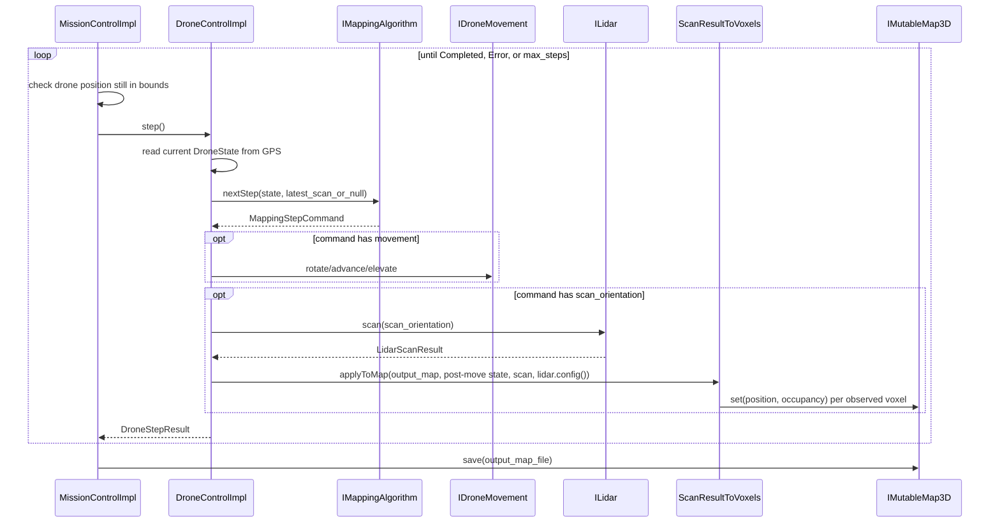
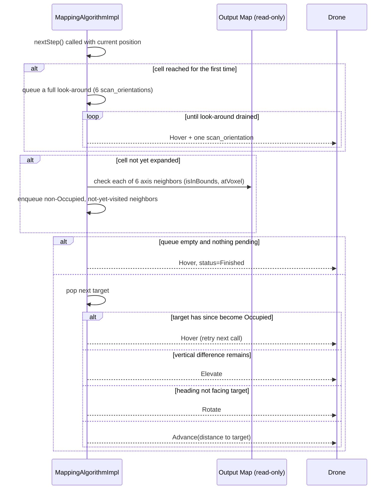

# Drone Mapper Simulation - Assignment 2 - High Level Design

Contributors: Amit Reif-Tagari 322698986

## Overview

The simulator loads a batch of scenarios from a `simulation_compositions.yaml`
file (drone/lidar/simulation/mission YAML configs, each referenced by path),
runs an autonomous drone through each one, and scores the drone's own
generated occupancy map against the hidden ground-truth map. All frozen
interfaces (`IMap3D`, `IMutableMap3D`, `IGPS`, `ILidar`, `IDroneMovement`,
`IDroneControl`, `IMissionControl`, `IMappingAlgorithm`, `ISimulationRun`,
`ISimulationRunFactory`, `ISimulation`) are implemented exactly as specified;
this document describes the concrete implementation behind them.

## Main Components

- `SimulationManager` expands the composition into every
  (simulation, mission) x drone x lidar combination, hands each to
  `ISimulationRunFactory`, and aggregates the results into a
  `SimulationManagerReport`. A combination that throws during construction
  or execution (e.g. an unreadable map file) is caught, logged immediately,
  and recorded as an error run scored -1 -- it does not abort the batch.
- `SimulationRunFactoryImpl` is the single construction seam: for one
  combination it loads the hidden map, builds a correctly-sized output map
  (honoring the mission's requested output resolution factor), and wires up
  GPS, movement, LiDAR, mapping algorithm, drone control, and mission
  control around them.
- `SimulationRunImpl` owns that per-run object graph, runs the mission, and
  assembles the final `SimulationResult` (score, output map path/config,
  resolution request status).
- `MissionControlImpl` drives the step loop: checks the drone is still
  within the output map's boundaries before every step, stops on a
  drone-reported error, and stops successfully once the mapping algorithm
  reports it is finished. It always saves the output map before returning.
- `DroneControlImpl` executes one step: ask the mapping algorithm what to
  do (given the previous step's scan, if any), perform the requested
  movement, then perform the requested scan (if any) and fold it into the
  output map via `ScanResultToVoxels`. Movement is always applied before
  the scan, so a scan requested alongside movement observes the
  post-movement state.
- `MappingAlgorithmImpl` is the exploration strategy: a 6-directional
  (+-X, +-Y, +-Z) frontier/BFS search. Because `MockLidar`'s single scan call
  only covers roughly a forward hemisphere around the direction it's aimed
  at, the algorithm spends the first 6 calls at any newly-reached cell doing
  a full look-around (one `scan_orientation` per axis direction, paired with
  Hover) before ever committing to a movement decision from that vantage
  point. Once oriented, it rotates to face a chosen neighbor before
  advancing (since `Advance` moves along the current heading, not toward an
  arbitrary point) or elevates directly for a purely vertical neighbor.
- `Map3DImpl` implements `IMutableMap3D` over an in-memory `NpyArray`.
  `MapConfig.offset` maps world-space (0,0,0) onto the array's own origin
  (`array_position = world_position + offset`); `MapConfig.boundaries` is a
  separate, independent constraint on where the mission is allowed to
  operate (it does not have to start at the array's corner).
- `CompositionLoader` parses `simulation_compositions.yaml` and every
  drone/lidar/mission/simulation YAML file it references. All referenced
  paths are resolved relative to the top-level composition file's own
  directory (matching the provided `inputs/` sample layout, where e.g.
  `map/scenario_small.npy` is a sibling of `simulation/`, not nested under
  it).
- `SimulationReportWriter` writes `simulation_output.yaml`: a hierarchical
  score report (simulations -> missions -> per drone/lidar runs), walking
  `composition` and `report` in lockstep since `SimulationManager` produces
  `report.runs` in the same nested order the composition was iterated in.
- `MapsComparison` compares an origin map to one or more target maps by
  walking the origin's physical boundaries and querying `atVoxel` on both
  sides by world position -- this is resolution-independent by
  construction (the bonus feature; see `bonus.txt`).

## Map Geometry And Results

- `MapConfig` bundles `MappingBounds`, `Position3D offset`, and
  `PhysicalLength resolution`.
- `SimulationConfigData` carries the hidden map file, its resolution, the
  world<->array offset, and the drone's initial position/heading.
- `MissionConfigData` carries `max_steps`, `gps_resolution`,
  `output_mapping_resolution_factor` (optional; missing defaults to factor
  1, and a requested factor < 1 is ignored with an immediate error log and
  `ResolutionRequestStatus::IgnoredTooSmall`), and `mission_bounds` (the
  mission's operational area; an unset/all-zero value falls back to the
  hidden map's full extent).
- `SimulationResult` carries one run's configs, mission results, output map
  file/config, resolution request status, and final score.
- `SimulationManagerReport` aggregates every generated `SimulationResult`.

## Class Diagram

```mermaid
classDiagram
    direction LR

    class ISimulation { <<interface>> +run(composition, output_path) report }
    class ISimulationRun { <<interface>> +run() result }
    class ISimulationRunFactory { <<interface>> +create(sim, mission, drone, lidar, output_path) run }
    class IMissionControl { <<interface>> +runMission() result }
    class IDroneControl { <<interface>> +step() step_result +state() state }
    class ILidar { <<interface>> +scan(orientation) scan +config() lidar_config }
    class IGPS { <<interface>> +position() position +heading() orientation }
    class IDroneMovement { <<interface>> +rotate(direction, angle) +advance(distance) +elevate(distance) }
    class IMappingAlgorithm { <<interface>> +nextStep(state, latest_scan) step_command }
    class IMap3D { <<interface>> +atVoxel(pos) occupancy +getMapConfig() config +isInBounds(pos) bool }
    class IMutableMap3D { <<interface>> +set(pos, value) +save(output_file) }

    class SimulationManager {
        -unique_ptr~ISimulationRunFactory~ run_factory_
        +run(composition, output_path) report
    }
    class SimulationRunFactoryImpl { +create(sim, mission, drone, lidar, output_path) run }
    class SimulationRunImpl {
        -unique_ptr~const IMap3D~ hidden_map_
        -unique_ptr~IMutableMap3D~ output_map_
        -unique_ptr~IGPS~ gps_
        -unique_ptr~IDroneMovement~ movement_
        -unique_ptr~ILidar~ lidar_
        -unique_ptr~IMappingAlgorithm~ mapping_algorithm_
        -unique_ptr~IDroneControl~ drone_control_
        -unique_ptr~IMissionControl~ mission_control_
        +run() simulation_result
    }
    class MissionControlImpl { +runMission() result }
    class DroneControlImpl {
        -LidarScanResult latest_scan_
        -bool has_latest_scan_
        +step() step_result
        +state() state
    }
    class MappingAlgorithmImpl {
        -queue~Position3D~ target_queue_
        -set visited_cells_
        -set expanded_cells_
        -queue~Orientation~ pending_scan_orientations_
        -set panorama_started_cells_
        +nextStep(state, latest_scan) step_command
    }
    class MockLidar { +scan(orientation) scan +config() lidar_config }
    class MockGPS { +position() position +heading() orientation }
    class MockMovement { +rotate() +advance() +elevate() }
    class Map3DImpl { +atVoxel(pos) occupancy +set(pos, value) +save(file) }
    class ScanResultToVoxels { +applyToMap(output_map, origin, heading, scan, lidar_config) }
    class MapsComparison { +compare(origin, targets) vector~double~ }
    class CompositionLoader { +load(composition_file) composition }
    class SimulationReportWriter { +write(composition, report, output_dir) }

    ISimulation <|.. SimulationManager
    ISimulationRunFactory <|.. SimulationRunFactoryImpl
    ISimulationRun <|.. SimulationRunImpl
    IMissionControl <|.. MissionControlImpl
    IDroneControl <|.. DroneControlImpl
    IMappingAlgorithm <|.. MappingAlgorithmImpl
    ILidar <|.. MockLidar
    IGPS <|.. MockGPS
    IDroneMovement <|.. MockMovement
    IMap3D <|-- IMutableMap3D
    IMutableMap3D <|.. Map3DImpl

    SimulationManager --> ISimulationRunFactory
    SimulationRunFactoryImpl --> SimulationRunImpl : transfers ownership
    SimulationRunImpl --> IMissionControl
    MissionControlImpl --> IDroneControl
    DroneControlImpl --> ILidar
    DroneControlImpl --> IMappingAlgorithm
    DroneControlImpl --> ScanResultToVoxels : uses
    MapsComparison --> IMap3D
    SimulationRunImpl --> MapsComparison : uses
```

## Mission Run Flow

## Exploration Strategy (MappingAlgorithmImpl)

## Known Limitations

- The mapping algorithm only ever targets the 6 axis-aligned neighbors of a
  cell (no diagonals), and a LiDAR reading closer than the sensor's
  configured `z_min` is reported as `PotentiallyOccupied` rather than a
  precise hit -- a real close-range sensor limitation. A voxel reachable
  only by standing inside solid space (fully shadowed on every side) may
  occasionally remain resolved only as `PotentiallyOccupied`.
- `output_mapping_resolution_factor` changes the *output* map's voxel size
  but the hidden map is always compared at its own native resolution via
  `MapsComparison`'s position-based (not index-based) comparison, so scores
  remain meaningful across differing resolutions.

See `readme.txt` for build/run instructions and `bonus.txt` for the bonus
feature.
